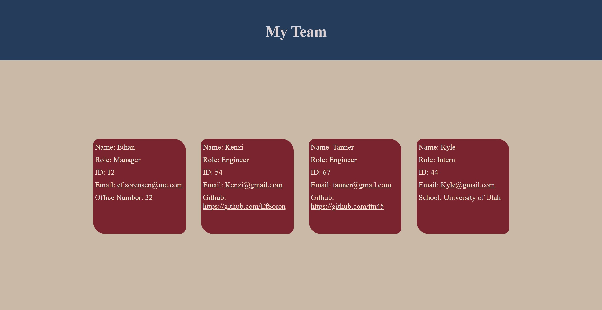

# c10-TeamGen 

## Description
Generates an html page to display your career team based upon command line input with node.js

## Installation
Inquirer and jest will need to be installed. Run npm i after cloning the repo

## Usage
Run node on the index.js file to be prompted with a series of questions. Your responses will be taken to format a custom HTML file

## License
This repo is licensed under the MIT License

## Tests
Tests done to ensure Employee classes formatted correctly

